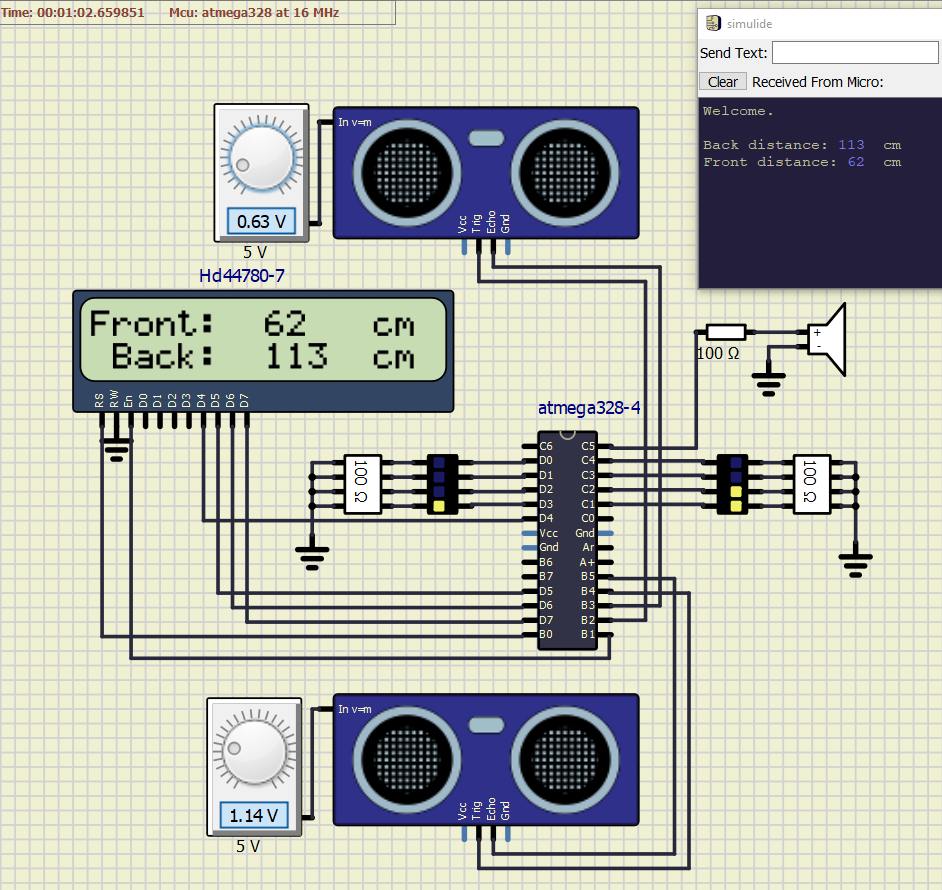
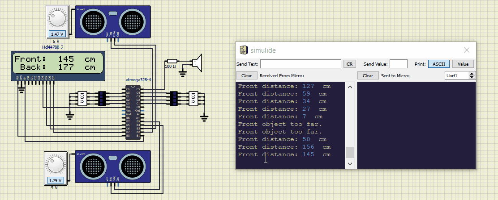

# Ultrasonic sensor HC-SR04

### Team members
Jan Sigmund, Michal Švento

[Link to GitHub project folder](https://github.com/xsigmu06/Digital-electronics-2/tree/master/Labs/Project)

### Project objectives
Description of ultrasonic sensor HC-SR04 control. Parking assistant application using several ultrasonic sensors (Micro > Sensors > HC-SR04, see examples/Arduino/Arduino_SR04); display; distance in centimeters; acoustic signaling with different frequencies according to distance; distance indication on LED bar; sending application status information to the UART.

## Hardware description
### Module

Ultrasonic sensor HC-SR04 enables measuring distance in range of 2 _cm_ to 4 _m_. It uses sonar to send high frequency impulses at 40 _kHz_, therefore it is not affected by sunlight or black material. Sound waves can also penetrate through water. Measurement accuracy can be up to 3 _mm_. Measuring angle is 15 degree.

### Pins
Input pin _Trigger_ must receive 10 _us_ long high pulse (5 _V_) to generate ultrasonic burst, which is then reflected off an obstacle back to receiver. When the sound wave gets back, a high value (5 _V_) will be set on output pin _Echo_. The width of this signal (in _μs_) is proportional to measured distance divided by 2 (the wave travels to object and back), which can be calculated as follows: 

_distance = time / 58 [cm]_

Speed of sound can also be used - for output in _cm_ convert velocity (e.g. 340 _m/s_) to _cm/μs_ and divide by 2:

_distance = time * velocity = time * 0.017 [cm]_

### Timing
The pulse width of _Echo_ high can be between 120 _μs_ (2 _cm_) and 23.5 _ms_ (400 _cm_). If no object is detected, or the distance is greater than 4 _m_, the _Echo_ signal will be max. 38 _ms_ long. To prevent previous pulse interfering with next measurement it is recommended to wait at least 60 _ms_ for each measuring cycle.

## Code description and simulations

Most of the functionality is implemented directly in `main.c` accessible [here](/Labs/Project/HC-SR04_final/Project_HC-SR04/main.c). Libraries used are C native, avr libraries and also from creator [Peter Fleury](http://tinyurl.com/peterfleury).

### Interrupts

#### Timer0 
Since the lowest possible value (without further alterations) for interrupt via timer overflow is for timer0 (16 _μs_), it is used for measuring the width of _Echo_ high. This should not diminish accuracy too much, as it is reasonably fast (lowest resolution is 0.272 _cm_). EDIT: The measurement error is up to 5 cm in greater distances. 

In it's ISR (Interrupt Service Routine) `TIMER0_OVF_vect`, state FSM (Finite State Machine) is used with two states: `TRIG` & `STATE_ECHO_MEAS`.

- `TRIG` state sends 10us Trigger pulse 
- `STATE_ECHO_MEAS` state measures width of Echo signal and calculated distance in _cm_.

#### Timer1 
`TIMER1_OVF_vect` ISR (prescaler for 262 _ms_) is used for displaying the measured distance for Front and Back modules on LCD and UART, and turning on/off LED bars based on distance (as seen on table) for both sensors individually. LED bars consists of 4 individual LEDs. For example, when distance is smaller than 15 _cm_ - all are turned on. On the other hand, if distance is bigger than 125 _cm_, LEDs are turned off completely.

Here, the frequency of _timer2_ interrupt enable `TIM2_interrupt_enable` and it's prescaler is also being manipulated. Again, according to distance, but this time for both ultrasonic sensors (the smaller distance is prioritized), this changes the length and frequency of tones tones generated through speaker. Length is being changed as the object would be closing in, the frequency is higher only when _distance < 15_.

|distance[_cm_]|No. of LEDs _ON_|
| :--: | :--:|
| <15  | 4|
| 15-50| 3 |
|51-100| 2 |
|100 - 125 | 1 | 
| >125 | 0 |

#### Timer2 
As specified previously, `TIMER2_OVF_vect` is used to indicate the distance with a speaker. For this a global variable `TIM2_off` is declared. Overflow is disabled when counter reaches the `TIM2_off` value. The overflow on _TIM2_ is enabled again, when _TIM1_ overflows. Frequency of speaker depends on closer object, prescaler for 4 _ms_ (250 _Hz_ tone) and 2 _ms_ (500 _Hz_) is being altered.

### Functions

#### displayResult
This function provides all outputs on LCD and UART. Data are send only when the value of distance is changed. 
We have three states, which can be displayed:

1. Distance is smaller than 2 cm - "*<2 cm*" is displayed
2. Distance between 2 - 400 cm - Absolute value is displayed
3. Distance > 400 cm - "*>400 cm*" is displayed

#### lcd_clear 
The function clears the part of display, where the value of distance is shown.

### Simulation

## Showcase

## References

HC-SR04 User's_Manual
https://docs.google.com/document/d/1Y-yZnNhMYy7rwhAgyL_pfa39RsB-x2qR4vP8saG73rE/edit#

HC-SR04 Ultrasonic Sensor datasheet
https://components101.com/ultrasonic-sensor-working-pinout-datasheet

HC-SR04
https://os.mbed.com/components/HC-SR04/

Atmega328P datasheet
https://ww1.microchip.com/downloads/en/DeviceDoc/Atmel-7810-Automotive-Microcontrollers-ATmega328P_Datasheet.pdf

