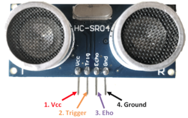

# Ultrasonic sensor HC-SR04

### Team members

Jan Sigmund, Michal Švento

[Link to GitHub project folder](https://github.com/xsigmu06/Digital-electronics-2/tree/master/Labs/Project)

### Project objectives

Description of ultrasonic sensor HC-SR04 control. Parking assistant application using several ultrasonic sensors (Micro > Sensors > HC-SR04, see examples/Arduino/Arduino_SR04); display; distance in centimeters; acoustic signaling with different frequencies according to distance; distance indication on LED bar; sending application status information to the UART.

## Hardware description

### Module

Ultrasonic sensor HC-SR04 enables measuring distance in range of 2 _cm_ to 4 _m_. It uses sonar to send high frequency impulses at 40 kHz, therefore it is not affected by sunlight or black material. Measurement accuracy can be up to 3 _mm_. Object detection is in 30 degree angle.

### Pins

Input pin _Trigger_ must receive 10 _us_ long high pulse (5_V_) to generate ultrasonic burst, which is then reflected off an obstacle back to receiver. When the sound wave gets back, a high value (5_V_) will be set on output pin _Echo_. The width of this signal (in _μs_) is proportional to measured distance divided by 2 (the wave travels to object and back), which can be calculated as follows: 

_distance = time / 58 [cm]_

Speed of sound can also be used - for output in _cm_ convert velocity (e.g. 340 _m/s_) to _cm/μs_ and divide by 2:

_distance = time * velocity = time * 0.017 [cm]_

### Timing

## Code description and simulations

*Write your text here*

## Video/Animation

*Write your text here*

## References

HC-SR04 User's_Manual
https://docs.google.com/document/d/1Y-yZnNhMYy7rwhAgyL_pfa39RsB-x2qR4vP8saG73rE/edit#
HC-SR04 Ultrasonic Sensor datasheet
https://components101.com/ultrasonic-sensor-working-pinout-datasheet

